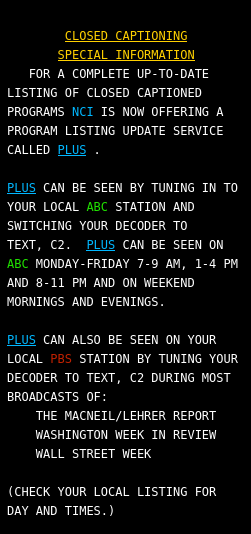
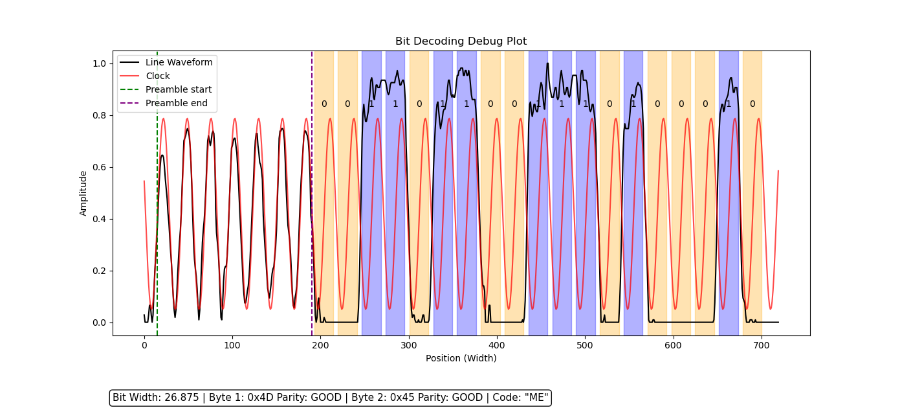

cc_decoder
==========
ccDecoder is a Python based Closed Caption Decoder/Extractor for
extracting line 21 closed caption embedded in video recordings.

Adapted from [CordySmith/cc_decoder](https://github.com/CordySmith/cc_decoder) by Max Smith and notonbluray.com

Requirements
============
* Python 3.12+
* Numpy, Matplotlib

Usage
=====

Extract subtitles in SRT format
* `cc_decoder.py -o video_file video_file.mpg`

Extract subtitles in SRT format from a **deinterlaced / progressive** video file
* `cc_decoder.py -o video_file --deinterlaced video_file.mpg`

Extract subtitles in SRT and SCC format
* `cc_decoder.py --ccformat srt,scc -o video_file video_file.mpg`

Extract XDS information
* `cc_decoder.py --ccformat xds -o video_file video_file.mpg`

Extract Text channel information
* `cc_decoder.py --ccformat text -o video_file video_file.mpg`

Examples
========

* Text Mode line 21 data decoded to HTML with formatting using `--ccformat=html`

  

* Debug Plot of bit decoding `--debug_plot`

  


Options
=======
```
usage: cc_decoder.py [-h] -o OUTPUT_SUBTITLE_NAME [-q] [--debug_plot] [--deinterlaced] [--ffmpeg] [--ffmpeg_pre_scale] [--ffmpeg_hw_accel] [--ccformat] [--start_line] [--end_line]
                     [--frame_rate]
                     videofile

Extracts CEA-608-E Closed Captions (line 21) data from a video file

positional arguments:
  videofile             Input video file name

options:
  -h, --help            show this help message and exit
  -q                    Suppress status output
  --debug_plot          Show a debug plot for each line that is detected

Output Options:
  -o OUTPUT_SUBTITLE_NAME
                        Output subtitle filename without extension
  --ccformat            Specify one or more comma separated output formats (e.g. srt,scc,text) 
                          srt   - SubRip subtitles (default)
                          scc   - Scenarist Closed Captions
                          html  - HTML output with styling and colors
                          text  - Plain text output (TEXT mode only)
                          xds   - eXtended Data Services (XDS) data
                          raw   - Raw caption data
                          debug - Debug output

Input Options:
  --deinterlaced        Specify if the input video is progressive (i.e. de-interlaced)
  --ffmpeg              Override the default path to the ffmpeg binary (default /home/ethan/bin/ffmpeg)
  --ffmpeg_pre_scale    FFMpeg video filter options before scaling.
  --ffmpeg_hw_accel     FFMpeg `hwaccel` option (i.e. none,auto,vaapi,nvdec,etc...) (default none)

Decoding Options:
  --start_line          Start at `start_line` when searching through the video 0=topmost line (default 0)
  --end_line            End at `end_line` when searching through the video (default 10)
  --frame_rate          Specifies the frame rate of the input video 
                          29.97 (NTSC) [default]
                          25    (PAL)
```

Performance
===========
About 10-20x realtime on my i7 machine. Primarily limited by FFMpeg
throughput.


Building Standalone.exe with Pyinstaller
========================================

Pyinstaller creates nice standalone .exe files for windows and beyond.

pyinstaller --clean --onefile --console --exclude-module scipy --upx-dir="c:\Program Files\UPX" cc_decoder.py
